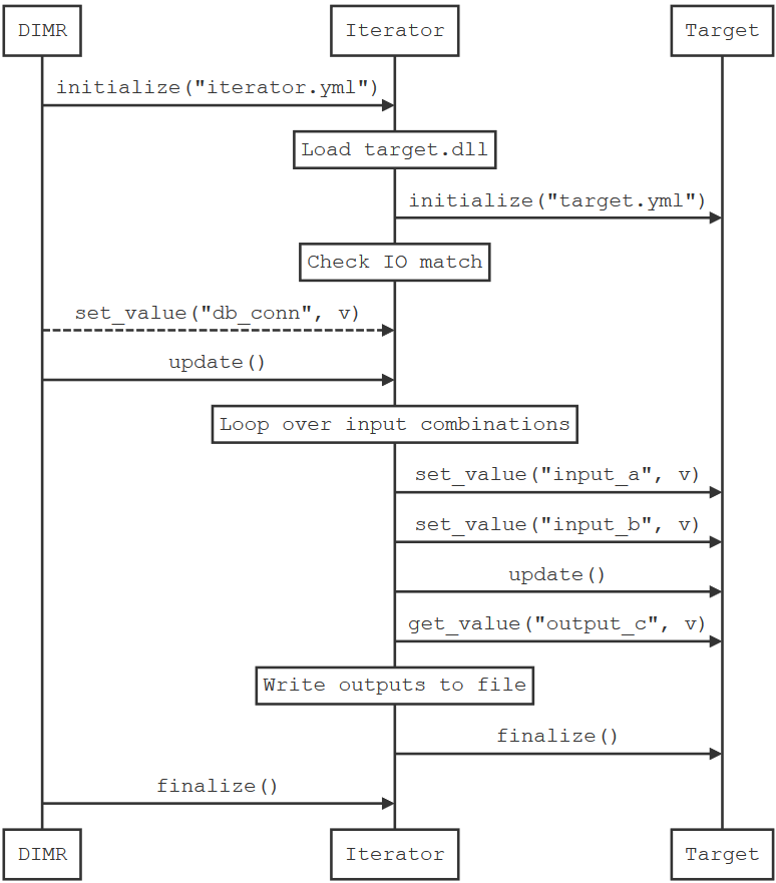

# BMI Iterator

A BMI component applying another BMI component over a dataset.

Typical usecase: applying a point-based model to a grid.

## Configuration

The BMI Iterator configuration is a [YAML](https://yaml.org/) file.

A minimal config must specify `inputs`, `outputs` and a `target`

```yaml
inputs:
  input_a: # requires db pointer to be set by runner
    type: int
    format: sqlite
    table: table_a
    column: column_a # optional, single column instead of whole table
  input_b: # direct connection to db
    type: double
    format: sqlite
    table: table_b
    path: data/tables.db
  input_c: # read from csv file
    type: str
    format: csv
    path: data/table_c.csv
    sep: ';'
ouputs:
  output_d: {type: int, format: sqlite, table: table_d}
target:
  library: component/libbmi_lookup.dll
  config: component/typology.yaml
```

### Inputs/Outputs

The `input` node lists the input tables/grids to be used as input. The input name must match the input names of the target component. Similarly, the `outputs` node lists all the output tables/grids to be generated. These must also match the target component's output names.

Input and output items point to a map describing where and how to access the data. All input and output item maps have at least the following keys:

- `type`: the data type, can be `int`, `double` or `str`. Applies to all columns.
- `format` : the storage format, can be `sqlite` or `csv`

Depending on the `format`,  additional fields may be required or optional.

#### sqlite

Required:

- `table`: the corresponding table name in the database

Optional:

- `column`: a specific column

- `path`: the path to the SQLite database file. If not provided, a SQLite connection pointer must be passed to the iterator (after initializing it) by calling its `set_value` method for variable `sqlite_ptr`.

#### csv

Required:

- `path`: the path to the csv file, relative to the config file location

Optional:

- `sep`: the separator to be used when parsing the csv file, defaults to `,`.


### Target

Describes the target component to be run by the iterator. `library` is the BMI compliant shared library to be loaded. `config` is the path to the config file expected by the target component.

## BMI Interface

The iterator has only one variable to be set: `sqlite__pointer`. Setting this variable is only required if one of the inputs or outputs needs it (see configuration).

The iterator will expose the input and outputs of the loaded target component. However `get_value` and `set_value` on the target's variable names is not implemented at this point (the methods are available but do nothing).

## Sequence



## Dependencies

The local paths to the following library headers and binaries should be set in `local.cmake`. See main `CMakeLists.txt` for details.

[YAML-CPP](https://github.com/jbeder/yaml-cpp/releases)

[SQLite](https://www.sqlite.org/download.html)

